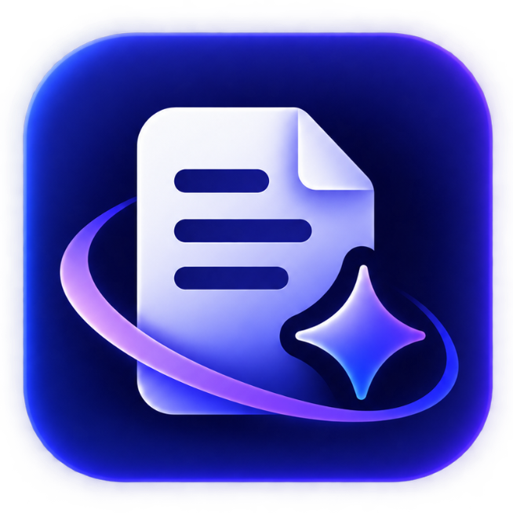
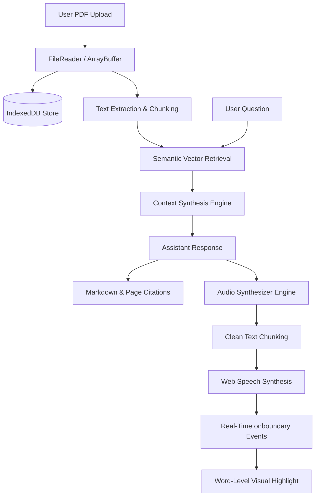

<div align="center">

  

  # LexiDoc
  ### Intelligent PDF Intelligence & Conversational Assistant

  <p align="center">
    Transform static PDF documents into interactive, context-aware AI conversations with exact page citations, real-time synchronized Text-to-Speech audio, and zero-data-loss local persistence.
  </p>

  <p align="center">
    <a href="https://react.dev/"></a>
    <a href="https://vitejs.dev/"></a>
    <a href="https://tailwindcss.com/"></a>
    <a href="https://developer.mozilla.org/en-US/docs/Web/API/Web_Speech_API"></a>
    <a href="https://developer.mozilla.org/en-US/docs/Web/API/IndexedDB_API"></a>
    <a href="https://nodejs.org/"></a>
    <a href="#license"></a>
  </p>

  <p align="center">
    <a href="#-features"><b>Explore Features</b></a> •
    <a href="#-quick-start"><b>Quick Start</b></a> •
    <a href="#-project-structure"><b>File System</b></a> •
    <a href="#-architecture--data-flow"><b>Architecture</b></a> •
    <a href="#-tech-stack"><b>Tech Stack</b></a>
  </p>

</div>

---

## 📖 Overview

**LexiDoc** is a modern document intelligence platform designed to bridge the gap between static, cumbersome PDF documents and natural human inquiry. Rather than skimming through hundreds of pages or relying on rigid keyword searches, LexiDoc allows users to have rich, nuanced dialogues with their documents.

LexiDoc pairs conversational retrieval with **real-time auditory feedback** (native Web Speech API with word-by-word visual karaoke highlighting), **lossless IndexedDB document persistence**, custom profile avatar management, and a glassmorphic user experience tailored for both dark and light modes.

---

## ✨ Features

### 📄 1. High-Performance PDF Ingestion & Preview
- **Drag-and-Drop Ingestion**: Instant drag-and-drop or file-picker upload for documents of any size.
- **Synchronized Document Viewer**: Read documents side-by-side with conversation using multi-page navigation, zooming, and direct page-jumping.
- **Smart Chunking & Token Extraction**: Splits long-form text across semantic boundaries for precision retrieval.

### 🎯 2. Context-Aware Q&A with Exact Citations
- **Source Grounding**: AI responses don't just answer; they prove their assertions by citing the exact source pages and excerpt snippets.
- **Citation Navigation**: Clicking any citation reference instantly scrolls to and highlights the relevant document page in the embedded viewer.

### 🔊 3. Native Text-to-Speech (TTS) with Live Word Highlighting
- **Zero Third-Party Dependencies**: Built entirely using the browser's native `window.speechSynthesis` API — no external cloud subscriptions, latency, or API keys required.
- **Karaoke Word-by-Word Highlighting**: Tracks speech audio in real time using native `onboundary` event streaming, highlighting the currently spoken word with theme-adaptive visual glow.
- **Dynamic Speed Switching**: Switch playback velocity on the fly (`0.75x`, `1x`, `1.25x`, `1.5x`, `2x`) without restarting the utterance from the beginning.
- **Intelligent Markdown & Symbol Cleaning**: Strips markdown markup, repetitive equal signs (`===`), dashed dividers (`---`), and formatting symbols before narration so speech sounds natural.
- **Singleton Speech Orchestration**: Only one response speaks at any time; selecting another seamlessly transitions playback.

### 👤 4. Custom Profile & Avatar Management
- **Interactive Camera Upload**: One-click photo upload directly from the Profile & Settings modal.
- **Client-Side Canvas Processing**: Automatically center-crops any portrait or landscape image into a crisp 256×256 square and compresses it (~20KB) to ensure lightning-fast storage.
- **Cross-App Synchronization**: Custom avatar displays immediately across the Top Navbar, Profile Modal, and User Chat Bubbles.
- **Instant Fallback**: One-click reset to dynamic initials-based letter avatars.

### 💾 5. 100% Reliable Local Storage & IndexedDB Persistence
- **Binary ArrayBuffer Caching**: Uploaded PDF files are converted and stored as binary `ArrayBuffer` objects in browser IndexedDB, eliminating the infamous "Blob URL invalidation on refresh" bug.
- **Persistent Chat History**: Re-open past conversations anytime from the Sidebar or History tab — your PDF will automatically reload and be ready to read and question.

### 🌓 6. Glassmorphic UI & Dual Theme System
- **Curated Palette**: Built with modern slate, indigo, and violet accents on frosted glass surfaces.
- **Dark & Light Modes**: System-synchronized or manually toggled with zero Flash of Unstyled Content (FOUC).

---

## 🏗️ Architecture & Data Flow



---

## 📂 Project Structure

```
LexiDoc/
├── public/                     # Static assets & brand identity
│   ├── logo.png                # Transparent high-res LexiDoc brand logo
│   ├── favicon.png             # 32x32 Tab favicon
│   ├── favicon-64.png          # 64x64 High-DPI & Apple Touch Icon
│   ├── favicon.ico             # Standard browser favicon
│   └── favicon.svg             # Vector fallback icon
│
├── src/
│   ├── assets/                 # Component assets
│   ├── components/             # Reusable UI component library
│   │   ├── ChatInput.jsx       # Query prompt input & submit controls
│   │   ├── ChatMessage.jsx     # Message bubbles + TTS highlight wrapper
│   │   ├── ChatWindow.jsx      # Message thread container & auto-scroller
│   │   ├── EmptyState.jsx      # New chat placeholder screen
│   │   ├── LoadingAnimation.jsx# AI reasoning indicator
│   │   ├── Navbar.jsx          # Top navigation bar with logo & user profile
│   │   ├── PDFPreview.jsx      # Embedded PDF document reader & pagination
│   │   ├── SettingsModal.jsx   # Profile editor & custom picture uploader
│   │   ├── Sidebar.jsx         # Chat history drawer & document manager
│   │   ├── SourceReference.jsx # Clickable page citations
│   │   ├── TextToSpeech.jsx    # Audio playback bar (play, pause, speed)
│   │   └── UploadArea.jsx      # Drag-and-drop PDF dropzone
│   │
│   ├── context/
│   │   └── AppContext.jsx      # Global state (User, Theme, Chats, Active PDF)
│   │
│   ├── hooks/
│   │   ├── useChat.js          # Chat message dispatching & state hooks
│   │   └── useTextToSpeech.js  # Speech synthesis singleton & word tracking
│   │
│   ├── pages/                  # Top-level view routes
│   │   ├── About.jsx           # Technical pipeline & architecture overview
│   │   ├── Chat.jsx            # Split-screen workspace (PDF + Chat)
│   │   ├── History.jsx         # Conversation archive & search
│   │   ├── Home.jsx            # Landing hero page
│   │   └── Login.jsx           # Authentication & demo sign-in
│   │
│   ├── services/
│   │   ├── api.js              # RAG query processing & mock AI engine
│   │   └── pdfService.js       # IndexedDB binary store & localStorage sync
│   │
│   ├── utils/
│   │   ├── helpers.js          # ID generators, formatting utilities
│   │   └── stripMarkdown.js    # Markdown & punctuation speech normalizer
│   │
│   ├── index.css               # Design system, highlight styles, animations
│   └── main.jsx                # Application root entry point
│
├── backend/                    # Optional Node.js RAG server
│   ├── routes/                 # Express API routes (upload, chat)
│   ├── services/               # Vector search & LLM integrations
│   ├── package.json            # Backend dependency declarations
│   └── server.js               # Express application gateway
│
├── index.html                  # HTML entry template with theme bootstrapper
├── package.json                # Project dependencies & npm run scripts
├── postcss.config.js           # PostCSS Tailwind plugins
├── tailwind.config.js          # Tailwind theme configuration
└── vite.config.js              # Vite bundler configuration & API proxies
```

---

## 🛠️ Tech Stack

| Domain | Technology | Description |
|---|---|---|
| **Frontend Framework** | React 18 | Declarative component-driven UI architecture |
| **Build & Tooling** | Vite 8 | Next-generation frontend bundler with sub-second HMR |
| **Styling** | Tailwind CSS 3 | Utility-first CSS engine with glassmorphism & dark mode |
| **Icons** | Lucide React | Modern, clean vector iconography |
| **Document Engine** | React-PDF | Client-side PDF page rendering & canvas view |
| **Voice & Speech** | Web Speech API | Browser-native speech synthesis with boundary event tracking |
| **Client Storage** | IndexedDB & LocalStorage | Lossless PDF binary caching and state persistence |
| **Routing** | React Router DOM 7 | Client-side page routing and deep-linking |
| **Backend (Optional)** | Express, Node.js, LangChain | Full RAG pipeline with ChromaDB and LLM connectors |

---

## 🚀 Quick Start

### 1. Prerequisites
- **Node.js**: Version `18.0.0` or higher
- **npm**: Version `9.0.0` or higher

### 2. Clone & Install
```bash
# Clone repository
git clone https://github.com/panchalaayush1611/LexiDoc.git

# Navigate into project directory
cd LexiDoc

# Install frontend dependencies
npm install
```

### 3. Launch the Application
```bash
npm run dev
```

The application will start locally at:
👉 **`http://localhost:5173`**

### 4. Optional: Launch Backend Service
If you want to connect to a live ChromaDB / LLM RAG backend:
```bash
cd backend
cp .env.example .env
npm install
npm run dev
```

---

## 🎯 Usage Guide

1. **Upload a PDF**: On the Home or Chat screen, drag & drop any PDF document or browse your files.
2. **Review Extracted Pages**: Browse through pages in the embedded viewer on the left pane.
3. **Ask Questions**: Type queries like *"Summarize key findings in Section 3"* or *"What are the contract terms?"*.
4. **Inspect Citations**: Click on any page badge in the response to instantly navigate to that page.
5. **Listen to Responses**: Click **Listen** to hear the response read aloud with live word highlighting. Change speeds (`0.75x` – `2x`) anytime!
6. **Customize Profile**: Click your avatar in the top navbar to upload your photo or edit your display name.

---

## 🛡️ License

Distributed under the **MIT License**. See `LICENSE` for more information.

---

<div align="center">
  <sub>Built by <b>Aayush Panchal</b> in love with LLMs</sub>
</div>
